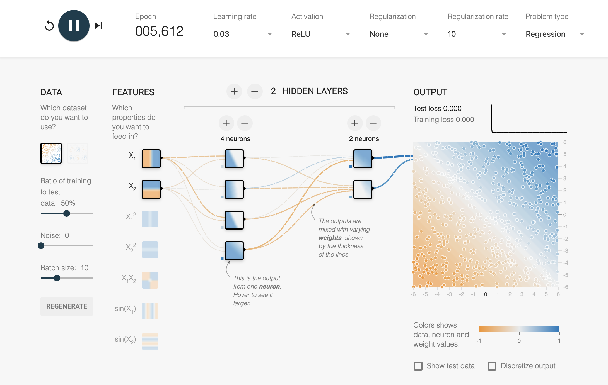

# Artificial Neural Network applications for analyzing attacks on DeFi protocols and platforms

Sena implements machine learning techniques such as supervised learning to created regression, classifcation, and predictive models with the S.E.A.L. dataset along with relevant metadata. Through using AI/ML, Sena will explore the feasibility of using artificial neural networks (ANNs) for risk assessment in predicting possible attacks using S.E.A.L. data. Sena is the first DeFi protocol to using AI/ML to analyze attack data.

|  Attack Type  | Neural Network |
| ------------- | -------------- |
|  DDos Attack  | Feed-forward Neural Network   |
| Smart Contract Bug  | Graph Neural Network   |
| Reentrancy    | Graph Neural Network |

<!-- image -->

  

Sources:
- https://reader.elsevier.com/reader/sd/pii/S1319157806800029?token=2EF11E26C870D27055A3E24E1E9E5FA0BBE72443A8FAB2CAC51BA87B480D569CF612869DB9F56B18D546E3FC4AAAE771&originRegion=us-east-1&originCreation=20220128064013
- https://www.ijcai.org/Proceedings/2020/0454.pdf
- https://link.springer.com/article/10.1007/s11276-020-02379-z
- https://arxiv.org/abs/2106.09282
