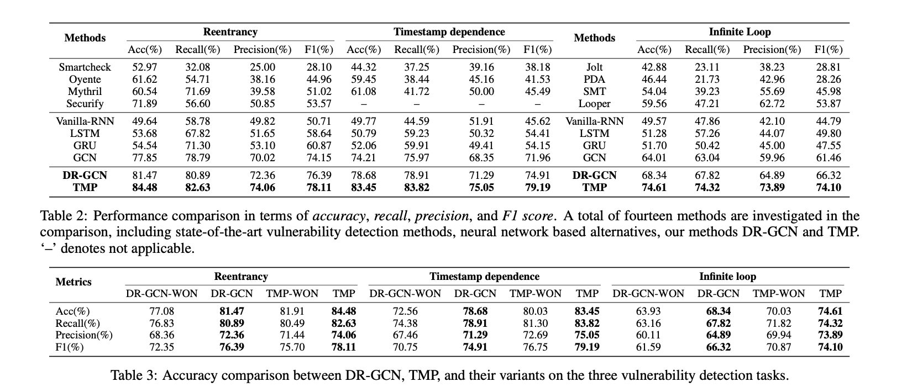

# ANN applications for analyzing attacks on DeFi protocols and vulnerable platforms

Sena implements machine learning techniques such as supervised learning to created regression, classifcation, and predictive models with the S.E.A.L. dataset along with relevant metadata. Through using AI/ML, Sena will explore the feasibility of using artificial neural networks (ANNs) for risk assessment in predicting possible attacks using S.E.A.L. data. Sena is the first DeFi protocol to using AI/ML to analyze attack data. By way of artificial neural networks we can analyze attack specific data in the decentralized finance domain.

|  Attack Type  | Neural Network Application | Sources |  
| ------------- | -------------- | ----------- | #1 |
|  DDos Attack1  | Feed-forward Neural Network   | #1 |
|  DDos Attack2   | Self-Organizing Map(SOM) | #1 |
| Smart Contract Bug  | Graph Neural Network (GNN)  | #2, #3, #5  |
| Reentrancy    | Graph Neural Network (GNN) |#3, #5 |
| Phishing Attack | Self-structuring Neural Network | #4 |
|  DDos Attack3   | Modified Adaptive Resonance Theory 2 (Modified ART2) | #6 |

<!-- image -->

  

Sources:
- 1. [DoS Attacks Intelligent Detection using Neural Networks](https://reader.elsevier.com/reader/sd/pii/S1319157806800029?token=2EF11E26C870D27055A3E24E1E9E5FA0BBE72443A8FAB2CAC51BA87B480D569CF612869DB9F56B18D546E3FC4AAAE771&originRegion=us-east-1&originCreation=20220128064013)
- 2. [A new scheme of vulnerability analysis in smart contract with machine learning](https://link.springer.com/article/10.1007/s11276-020-02379-z)
- 3. [Smart Contract Vulnerability Detection: From Pure Neural Network to Interpretable Graph Feature and Expert Pattern Fusion](https://arxiv.org/abs/2106.09282)
- 4. [Predicting phishing websites based on self-structuring neural network](https://link.springer.com/article/10.1007/s00521-013-1490-z)
- 5. [Smart Contract Vulnerability Detection Using Graph Neural Networks](https://www.ijcai.org/Proceedings/2020/0454.pdf)
- 6. [Detection of malicious and non-malicious website visitors using unsupervised neural network learning](https://www.sciencedirect.com/science/article/abs/pii/S1568494612003778)
