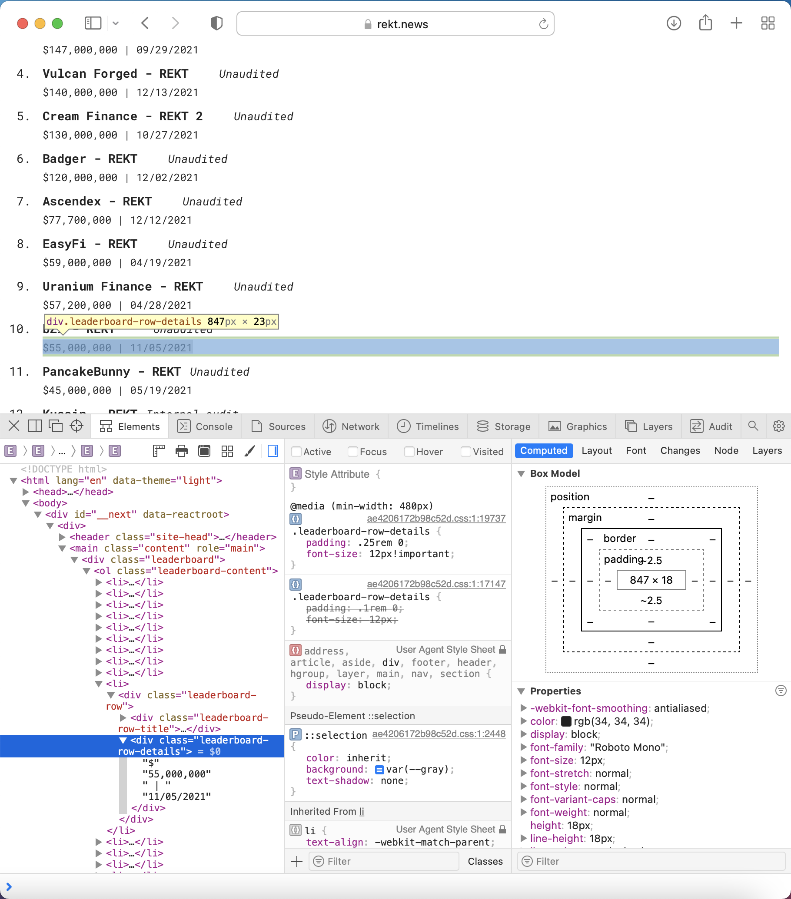

# Advanced Attack Analysis(A<sup>3</sup>)

The Advanced Attack Analysis(A<sup>3</sup>) is a deep data analysis repo, uncovering the latest insights on attacks within the Web3 ecosystem. Methods such as EDA, web scrapping, Python requests, and API calls are used to retrieve attack specific data. Sena is a vulnerability detector by way of ANN applications. 

Sena has the ability to utilize past attack data to perform prescriptive analytics using AI/ML as well as building models that will be used as data visualizations on the Sena application. The system to curate live data will be done by analyzing on-chain and off-chain data from the blockchains of DeFi protocols we analyze.

Attacks recorded from then and now are utilized to make inferences so that a predictions based on data stored in the SEAL dataset can support Sena protocol's analytical acrchitecture to detect high priority vulnerabilities before they lead to possible attacks. The use of ANNs support the vulnerability-attack prevention framework. The Sena DApp will give alerts when attacks occur and warning messages when the analytical architecture detects vulnerabilities.

> <b> Index terms: </b> </br>
> EDA - Exploratory Data Analysis (typically conducted to display relationships between metadata) </br>
> Supervised Learning - a machine learning technique that uses labeled data to train algorithms into predicting and classifying outcomes accurately </br>
> SEAL - Sena Exploratory Attack Library dataset </br>
----

## Insights into Web Scraping using Python BeautifulSoup
<!-- image -->
<p style="text-align:center;">
  
</p>

Each data vector needed to be cleaned: protocol names, dates, and amount lost in attack.
The most intricate vector that needed prime attention were the dates. Dates and amounts with concatenated together with excessive spaces and a vertical bar(|). 

Here's an example of how the data is formatted within the HTML text: 
```
Input: '$55,000,000 | 11/05/2021'
```
The amount lost and dates are concatenated together which makes the task of curating each item difficult. But with BeautifulSoup the task is much easier.

> Here's a few lines of code used to extract the dates from the unstructured html text data:
```
clean_dates = [] # Empty list to store cleaned dates
for item in dates:
    i = item.lstrip(',000,000 | ') # Removes the leading characters
    
    clean_dates.append(i)
```
> Trial and error was used to find the proper parameters for the .lstrip method used to remove leading chars in Strings.
```
Output: 11/05/2021
```

> Redirect link: [Follow the logic and results in the web scraper directory.](https://github.com/SenaLabs/adv-attack-analysis/blob/main/web-scraper/rekt-news-ws.ipynb)

## Applied Research: Discovering vulnerabilities before the attacks happen
Attacks only exist due to vulnerabilities and [attack vectors](https://github.com/sigp/solidity-security-blog). Throughout building the code base, within the attack analysis repo we will do extensive research into specific vulnerabilities with the code for DeFi protocols. 

The inception of DeFi is a contentious subject, but in this repo we aggregate attack data from the later MakerDAO and Ethereum days. Around 2015, new chains began to emerge to partipate in the decentralized finance industry. 
