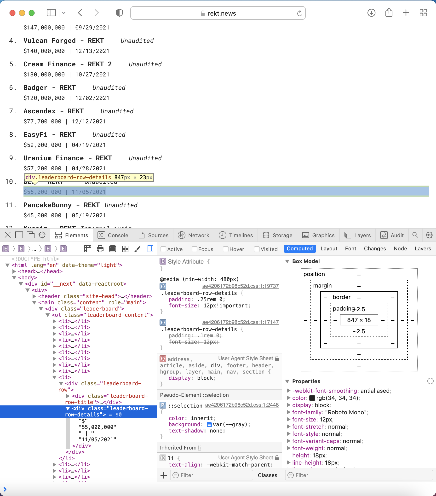

# Advanced Attack Analysis

The Advanced Attack Analysis is a deep data analysis repo, uncovering the latest insights on attacks within the DeFi ecosystem. Methods such as EDA, web scrapping, Python requests, and API calls are used to retrieve attack specific data. Sena has the ability to utilize past attack data to perform prescriptive analytics using machine learning as well as building models that will be used as data visualizations on the Sena application. The inception of DeFi is a contentious  subject, but in the advanced attack analysis repo we aggregate attack data from the later MakerDAO and Ethereum days. Around 2015, new chains began to emerge to partipate in the decentralized finance industry. 

Attacks recorded from then till now are utilized to make inferences so that a predictions based on data stored in the S.E.A.L. dataset can support Sena protocol's analytical acrchitecture to detect high priority vulnerabilities before they lead to possible attacks. The Sena application will give alerts when attacks occur and warning messages when the analytical architecture detects vulnerabilities.

> <b> Index terms: </b> </br>
> EDA - Exploratory Data Analysis,
> Supervised Learning - a machine learning technique that uses labeled data to train algorithms into predicting and classifying outcomes accurately, 
> S.E.A.L. - Sena Exploratory Attack Library dataset
----

## Insights into Web Scraping using Python BeautifulSoup
<!-- image -->
<p style="text-align:center;">
  
</p>

Each data vector needed to be cleaned: protocol names, dates, and amount lost in attack.
The most intricate vector that needed prime attention were the dates. Dates and amounts with concatenated together with excessive spaces and a vertical bar(|). 

> Here's a few lines of code used to extract the dates from the excessive html text data:
```
clean_dates = []
for item in dates:
    regex = " (\\d{2}/\\d{2}/\\d{4})";
    i = item.lstrip(',000,000 | ')
    
    clean_dates.append(i)
```
> [Follow the logic and results within the web scraper directory.](https://github.com/SenaLabs/adv-attack-analysis/blob/main/web-scraper/rekt-news-ws.ipynb)

## Applied Research: Discovering vulnerabilities before the attacks happen
Attacks only exist due to vulnerabilities and [attack vectors](https://github.com/sigp/solidity-security-blog). Throughout building the code base, within the attack analysis repo we will do extensive research into specific vulnerabilities with the code for DeFi protocols. 
