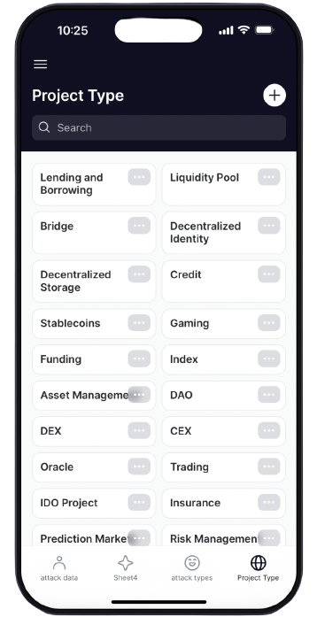

# A3: Advanced Attack Analysis

The Advanced Attack Analysis(A3) is a deep data analysis repo, uncovering the latest insights on attacks within the Web3 ecosystem. Methods such as EDA, web scrapping, Python requests, vulnerability detection and [Beneath API](https://beneath.dev/bubblyorca/seal-dataset) (halted acquired by RillzData) calls are used to retrieve attack specific data to explore what's happening on-chain with vulnerable Web3 products. The algorithm detects vulnerabilities through applied ANNs. 

Rektify AI utilizes past attack data to perform prescriptive analytics using AI/ML as well as building models that will be used as data visualizations on the Rektify AI application. The system to curate live data will be done by analyzing on-chain and off-chain data from the blockchains of DeFi protocols we analyze.

Attacks recorded from then and now are utilized to make inferences so that a predictions based on data stored in the REAL API data warehouse can support analytical acrchitecture to detect high priority vulnerabilities before they lead to possible attacks. The use of ANNs support the vulnerability-attack prevention framework. The Rektify AI application will give alerts when attacks occur and warning messages when the deep learning system is triggered by vulnerabilities.

<!-- image -->

  

> <b> Index terms: </b>  
> AI/ML - Artificial Intelligence and Machine Learning
> EDA - Exploratory Data Analysis (typically conducted to display relationships between metadata)  
> Supervised Learning - A machine learning technique that uses labeled data to train models to  predict and classify outcomes  
> REAL - Rektify Exploratory Attack Library dataset  
> ANN - Artificial Neural Network  
> DApp - Decentralized Application
----

## Applied Research: Discovering vulnerabilities before the attacks happen
Attacks only exist due to vulnerabilities and [attack vectors](https://github.com/sigp/solidity-security-blog) that lead to possible intrusion. Throughout building the code base, within the attack analysis repo we will do extensive research into specific vulnerabilities with the code for DeFi protocols. 

The inception of DeFi is a contentious subject, but in this repo we aggregate attack data from the later since the inception of Bitcoin and Ethereum days. Around 2015, new chains began to emerge to partipate in the decentralized finance industry. 

----
## Registry
[SWC Registry](https://swcregistry.io)  
[DeFi Hack Labs](https://github.com/SunWeb3Sec/DeFiHackLabs)  
[Ethernaut](https://ethernaut.openzeppelin.com)  
[Ethernaut CTF](https://github.com/OpenZeppelin/ethernaut)
