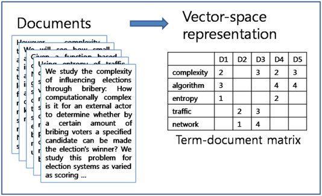

## Twitter API Repo

Twitter is the most prevalently used social media application for crypto users. Twitter also hosts real-time tweets about on-chain and off-chain activity that is happening to blockchain-based assets. These tweets are consiered "alerts" in this repo. With Twitter we can track user sentiment and hack alerts, and then process the vectorized text using TD-IDF.

<!-- image -->

  

### Tweet Validity Bot Program: Spam or ham :pig:
----
**Goal**
 
In this exercise we sift through official projects tweets about possible reimbursement from an attack. From there, we capture as many phrases from users in the event of a hack to 1. test validity of the request being from an acutal human being or a bot, and 2. rank the severity of the attack based on their diction. Fake users tend to state things such as "victim" or "wen refund". 

Keywords or phases to look for from scammers:
- $ amounts
-  amoumt [token]
- victim
- refund
- wen
- returned
- "any chance of refund"
- 128-bit contract hash
- con't.

Keywords or phases to look for from actual victims:
- $ amounts
- 128-bit contract hash with image attachment
- "project name"
- expletives [i.e., "project_name needs to get their shit together]
- [negative words of expression]

**Challenge**
The challenges arise in the raw data scraped from tweets are scammers fake sentiments. 

**Strategy**
<!-- image -->

  

