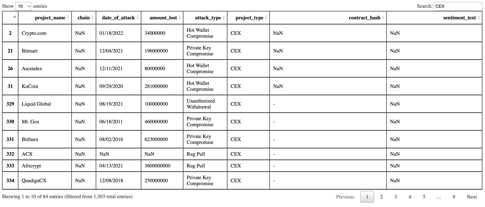

# Rektify Exploratory Attack Library(REAL) dataset

The Rektify Exploratory Attack Library(REAL) dataset is the end point to data curation tasks. The vision for the dataset is to become an NFT so that others that use REAL, will have co-ownership REAL data. By way of smart contracts we can prove the provenance of REAL data and allow for collaboration by maintainers from the Rektify AI community.

<!-- image -->

  

 

Data visualizations created from REAL data will be considered REAL artifacts which will also become NFTs. Rektify AI aims to use REAL beyond conducting multi-variate statistical analysis to make inferences. Analysts' creativity is accepted and strongly promoted as a means create expression with data beyond the domains of math and science.

The REAL risk dashboard comprises of all the token investments Rektify AI users have on their wallet of choice.
