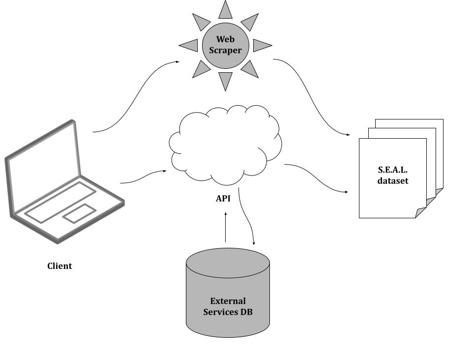

# Sena Web Scraper

The web scraper is used to extract data from webpages using Python's BeautifulSoup. We wish to use DeFi exploit specific APIs to autonmously funnel data into SEAL, but the DeFi industry is still relatively new. The main API we can utilize at this time is the Nansen.ai API. We hope to land them as a potential partner. 

<!-- image -->
<p style= "text-align:center;">
  
</p>

To expand the data-driven functionality of Sena we are building our own API with all the DeFi attack data we've curated to be the one-stop shop for the DeFi ecosystem. In the meanwhile, Python's BeautifulSoup allows us to extract qualitative and quantative attack data from HTML/XML text inside of webpages. 

The following websites are used in Sena's web scraper:
>- [rekt.news](https://rekt.news) - #1 resource for DeFi hacks across the ecosystem
>- [bitcoinexchangeguide](https://bitcoinexchangeguide.com/bitcoin/scams-hacks/#Picostocks_Cold_Wallet_Hack)
>- [CertiK](https://www.certik.com)
>- [coingeek](https://coingeek.com/the-defi-hacks-of-2020/)
>- [cryptobriefing hack archive](https://cryptobriefing.com/tag/hack/)
>- [crypto.sec](https://cryptosec.info/defi-hacks/)
>- [crypto slam](https://cryptoslam.io)
>- [defiprime.com](https://defiprime.com/hacks2020)
>- [defiyieldapp-rektdatabase](https://defiyield.app/rekt-database)
>- [etherscan](https://etherscan.io)
>- [hedgewithcrypto](https://www.hedgewithcrypto.com/cryptocurrency-exchange-hacks/)
>- [idex](https://blog.idex.io/all-posts/a-complete-list-of-cryptocurrency-exchange-hacks-updated/#2012)
>- [rugdoc projects](https://rugdoc.io/project/)
>- [slowmist.io](https://hacked.slowmist.io/en/)
>- [squanch](https://github.com/TheSquanch-147/Rugpulls-Hacks-Exploits-List)
>- [quadrigainitiative](https://www.quadrigainitiative.com/hackfraudscam/btfinancehack.php)
>- [watchpug](https://watchpug.medium.com)
>- [wowisme](https://www.wowisme.net/defi-security-vulnerabilities-and-exploits-2021/)


# Get requests through APIs
>- TVL data: [DeFi Llama](https://docs.llama.fi/api)
>- Protocol behavior: [Twitter](https://developer.twitter.com/en/docs/twitter-api/getting-started/about-twitter-api)
>- Overall DeFi market trends: [DeFi Pulse](https://docs.defipulse.com/api-docs-by-provider/defi-pulse-data) 
>- NFT API: [QuickNode](https://www.quicknode.com/nft-api)
>- Social behavior of DeFi users/protocols: [LunarCrush](https://legacy.lunarcrush.com/developers/docs), [PyPi page](https://pypi.org/project/lunarcrush/)


The preceding are a few APIs Sena will be using to curate protocol specific data. DeFi Llama's API is a source to retrieve total value locked at the time of the exploit, a registery of DeFi protocols, and on-chain data. DeFi Pulse's API gives access to ETH gas prices as well as an on-slot of data providers for future needs. Twitter's API allows us to monitor protocol activity. All data curated from these APIs will be curated under columns in the SEAL dataset. 

----


## Insights into Web Scraping using Python BeautifulSoup

Each data vector needed to be cleaned: protocol names, dates, and amount lost in attack.
The most intricate vector that needed prime attention were the dates. Dates and amounts with concatenated together with excessive spaces and a vertical bar(|). 

Here's an example of how the data is formatted within the HTML text: 
```
Input: '$55,000,000 | 11/05/2021'
```
The amount lost and dates are concatenated together which makes the task of curating each item difficult. But with BeautifulSoup the task is much easier.

> Here's a few lines of code used to extract the dates from the unstructured html text data:
```
clean_dates = [] # Empty list to store cleaned dates
for item in dates:
    i = item.lstrip(',000,000 | ') # Removes the leading characters
    
    clean_dates.append(i)
```
> Trial and error was used to find the proper parameters for the .lstrip method used to remove leading chars in Strings.
```
Output: 11/05/2021
```

> Redirect link: [Follow the logic and results in the web scraper directory.](https://github.com/SenaLabs/adv-attack-analysis/blob/main/web-scraper/rekt-news-ws.ipynb)

<!-- image -->
<p style="text-align:center;">
  
</p>
